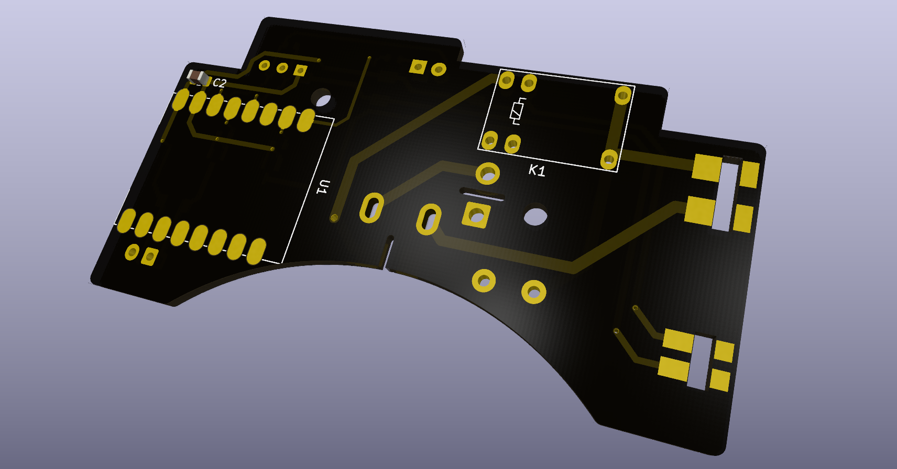
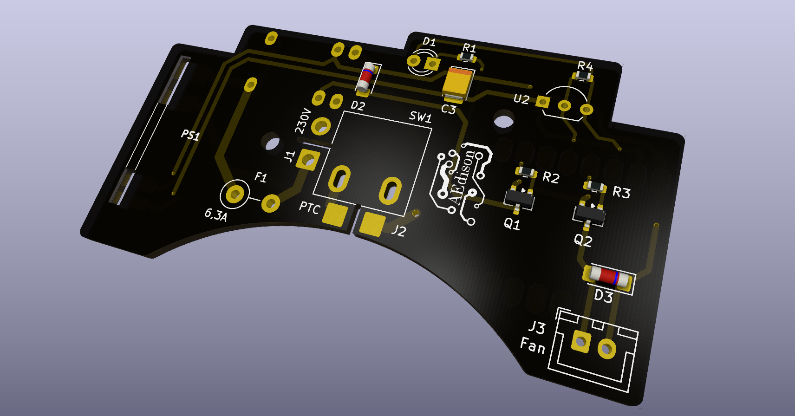

# Control PCB

Custom control board for the [Elegoo Centauri Carbon chamber heater](../README.md).

| Front | Back |
|---|---|
|  |  |

## Manufacturing

Gerber files for PCB production are included in this folder: [`Elegoo_heater_gerber.rar`](Elegoo_heater_gerber.rar).

Boards for this project were manufactured at [JLCPCB](https://jlcpcb.com/).
