# Elegoo Centauri Carbon automatic chamber heater — hardware

**Hardware** repository for **[Auto-CC1-heater-firmware](https://github.com/AEdison-tech/Auto-CC1-heater-firmware)** — an ESP32-C3 controller that automatically heats a printer's enclosure by watching the CC1's WebSocket status, driving a relay heater + fan with hysteresis temperature control.

This repository documents the physical build: a salvaged "Mini Heater" enclosure rebuilt around a custom control PCB, a PTC ceramic heating element and a fan, all driven by the ESP32-C3 firmware.

---

## Finished unit

| | |
|---|---|
|  | 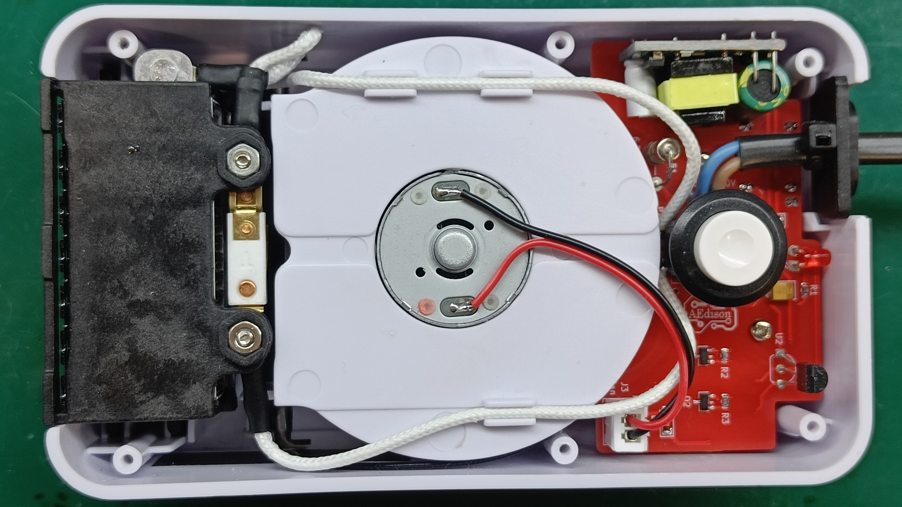 |

The donor device is a cheap "Mini Heater" (see below) — its case, heating element and fan are reused, while the internal electronics are replaced with a custom PCB (see [`/PCB`](PCB)) running the [firmware](https://github.com/AEdison-tech/Auto-CC1-heater-firmware).

## Custom control PCB

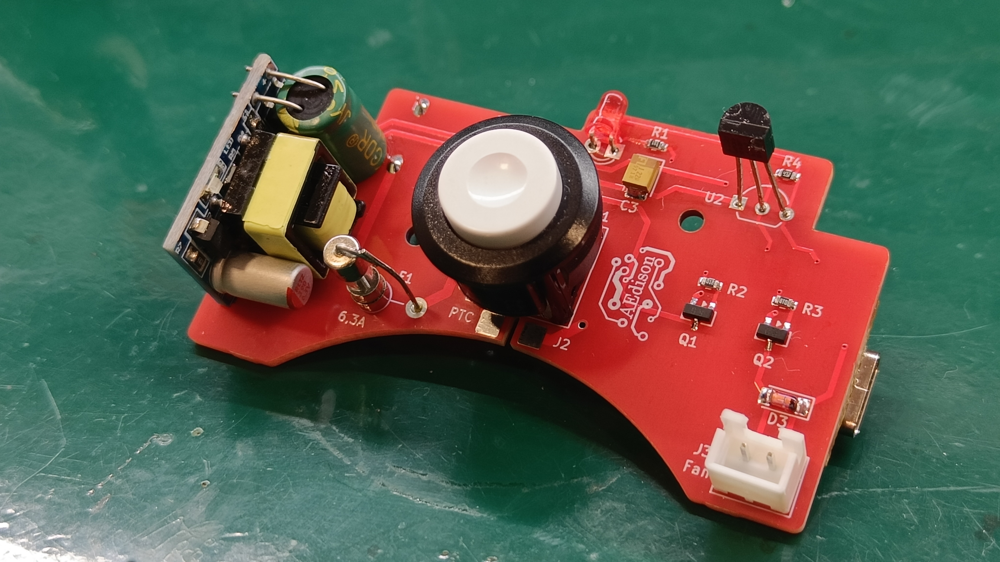

| | |
|---|---|
| 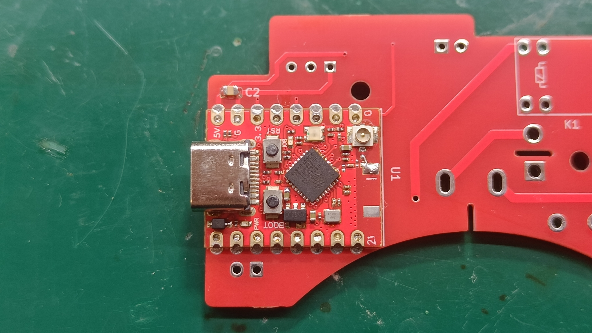 | 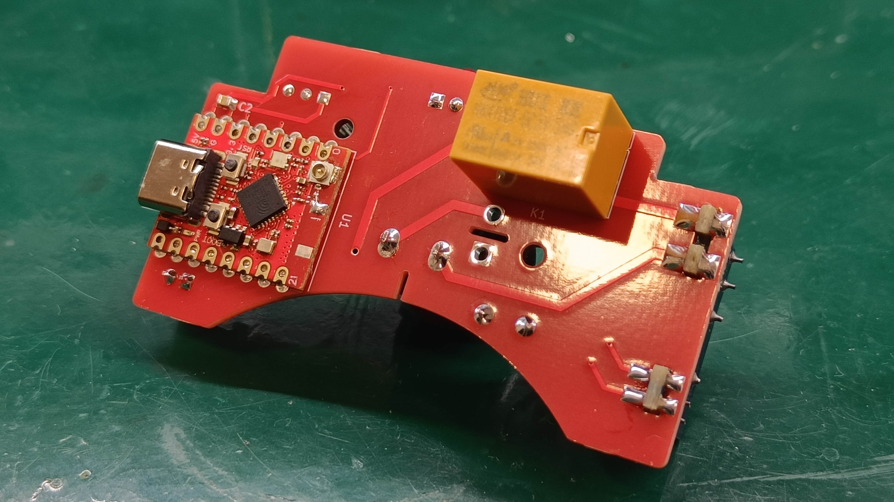 |

The board carries the ESP32-C3 module, a relay for the PTC element, MOSFET drivers for the fan and status LED, a thermistor input and a small isolated mains-to-5V supply for the logic side.

## Donor unit & case modification

| | | |
|---|---|---|
| 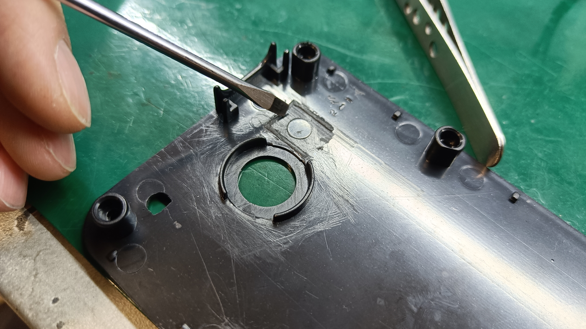 | 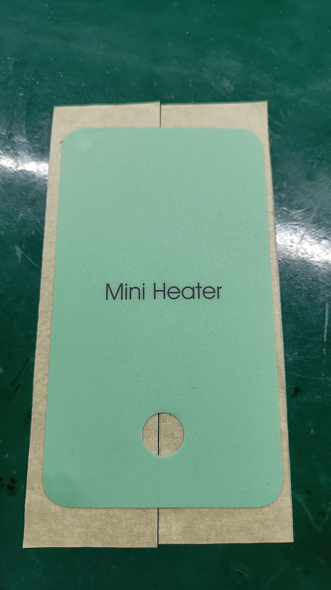 | 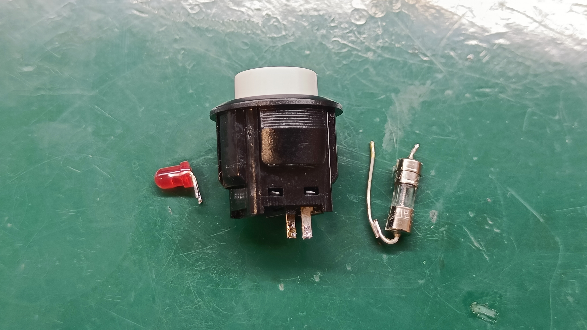 |

This build starts from a cheap [heating fan bought on Amazon](https://www.amazon.com/Heating-Electric-Heater-Bracket-Office/dp/B0DX1RNQML). The original control board is discarded — only the switch, indicator LED and glass fuse are salvaged and reused on the new custom PCB, alongside the original front sticker.

The listing is available in both 230 V and 110 V variants — it doesn't matter which one is bought, the internals are identical. Since the PTC heating element is self-regulating by temperature, the only real difference between the two voltage variants is the cold-start peak current draw.

Fitting the new PCB into the original enclosure required a small case modification: on the back of the top plastic cover, a mounting nub that used to hold the original connector has to be broken/filed off — the connector itself is no longer used, and the nub would otherwise be in the way.

The case also needs two holes cut by hand: one for the temperature sensor, and one on the side for USB access. Exact positions aren't documented — they were milled into the case "by eye". If this project ever takes off, a 3D-printed drilling template showing the exact hole positions and sizes might happen — but that's a fair bit of extra work for now 🙂

## Logic power supply module

| | |
|---|---|
| 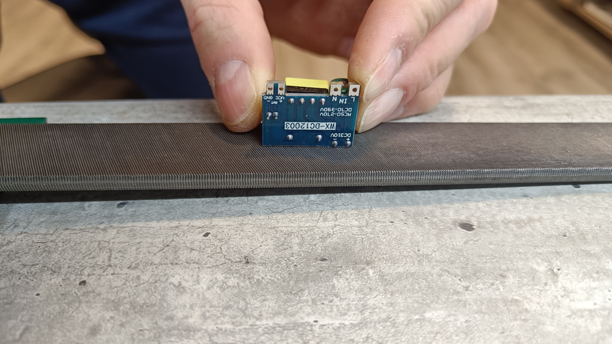 | 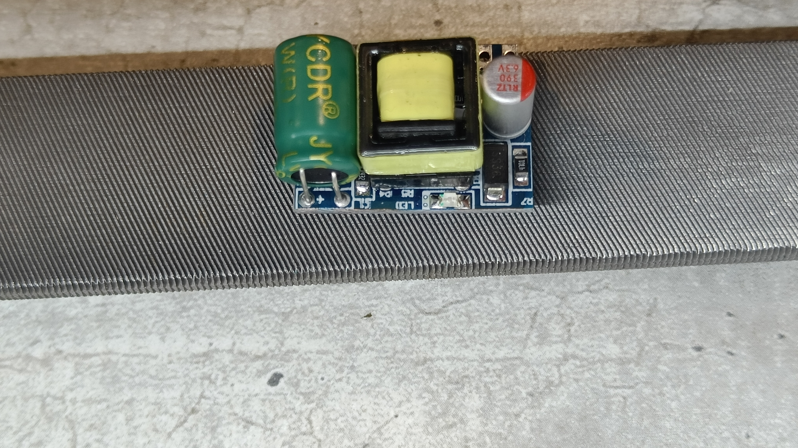 |

Low-voltage logic power (5 V / 700 mA, 3.5 W) is provided by a small isolated mains-to-DC module (`WX-DC12003`), soldered directly onto the main PCB (footprint `PS1`).

- Module used: [AliExpress listing](https://www.aliexpress.com/item/4000837048338.html?spm=a2g0o.order_list.order_list_main.36.50711802VtwlVK).
- The module is roughly 0.5 mm taller than the available space inside the enclosure. This is fixed by sanding down ~0.5 mm from the top side of the module, right where the status LED sits — there are no traces or solder joints in that area, so it can be sanded flat without damaging the module (see photos above for exactly where to remove material).

## PTC heating element & wiring

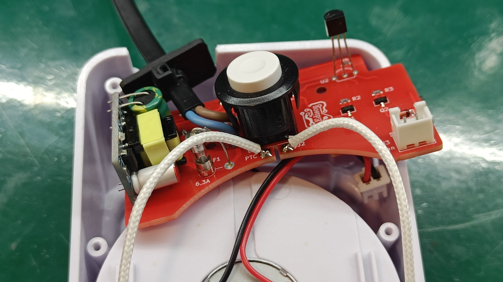

Given the isolation clearances around the mains section and the surrounding component layout, soldering the leads directly onto the pads, as shown above, was the only way to make the connection work.

## 3D-printed cable spacer

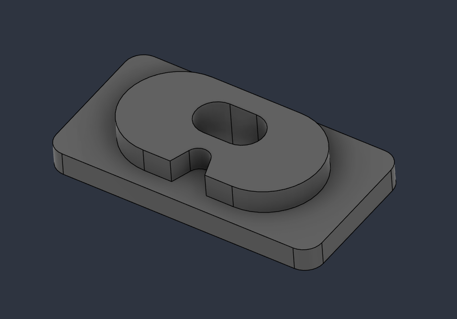

A small 3D-printed spacer guides the mains cable through the enclosure wall. Source files are included in this repo:

- [`Heater cable spacer.f3d`](Heater%20cable%20spacer.f3d) — Fusion 360 project
- [`Cable_spacer.stl`](Cable_spacer.stl) — ready-to-print STL

It's recommended to secure the cable with a zip tie right behind the spacer, on the inside, to prevent it from being pulled out.

## Connecting to the printer

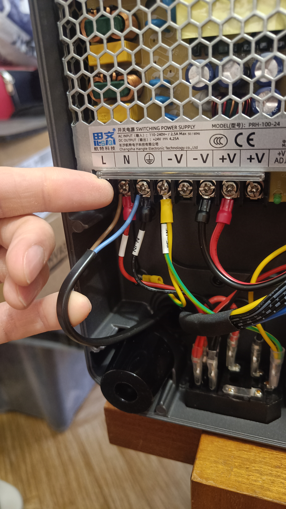

When wiring the finished heater into the printer's own power distribution, the printer's internal power-supply terminal block is the more suitable connection point from a current-distribution standpoint, compared to tapping power elsewhere in the printer.

> **⚠️ Fuse rating:** the CC1 ships with a 10 A input fuse. The PTC element can draw up to ~7 A cold-start inrush current, and if this coincides with the print bed heater also being active, the combined current can trip (or blow) the stock 10 A fuse. This hasn't happened during testing so far, but replacing the stock fuse with a **15 A** fuse is recommended.

---

## Related

- Firmware: [AEdison-tech/Auto-CC1-heater-firmware](https://github.com/AEdison-tech/Auto-CC1-heater-firmware)
- PCB design, gerbers & manufacturing notes: [`/PCB`](PCB)
